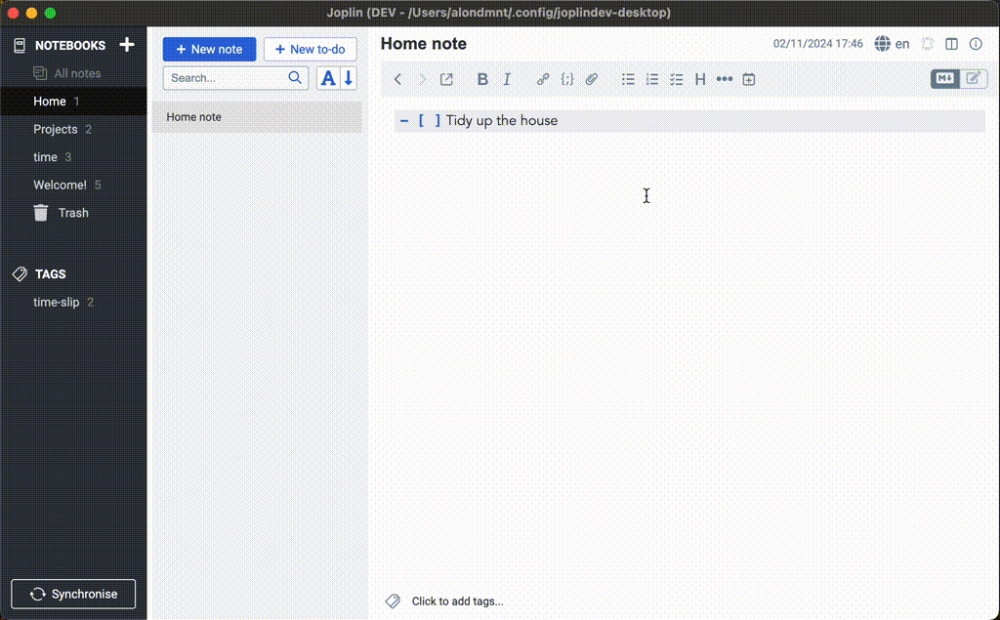

# ↺ Resume Note

A [Joplin](https://joplinapp.org/) plugin to continue editing the last active note in each notebook, and go back to the last cursor position in the Markdown editor.

## Features

- Save and restore the last active note in each folder
- Save and restore the cursor position in the Markdown editor for each note
    - Optionally use note properties to sync across devices and Joplin sessions
- Set a home note or load the last active note on startup

